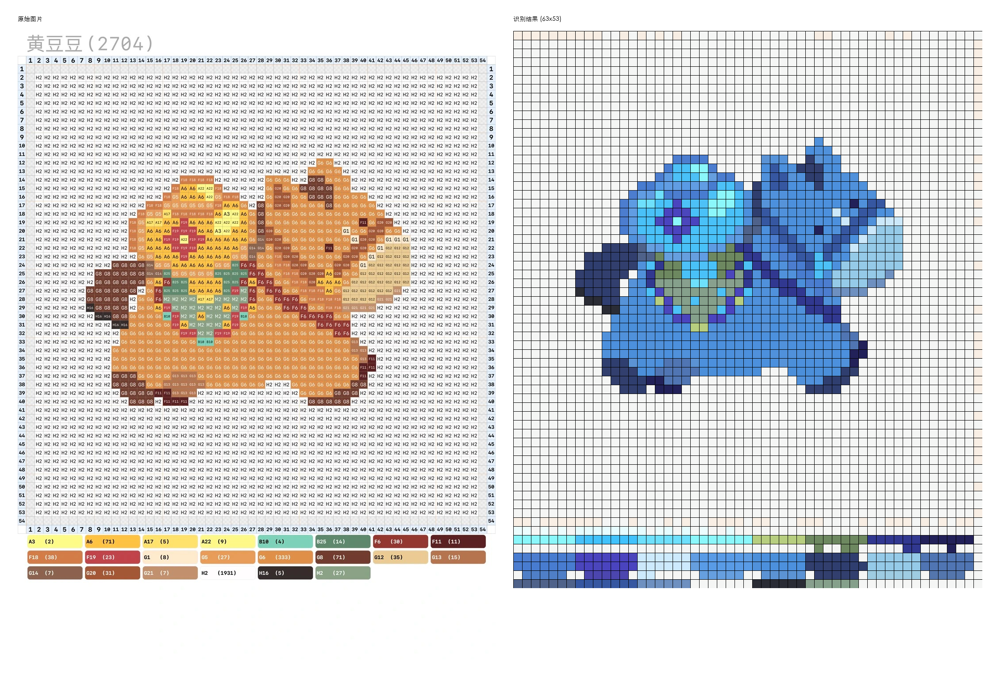

# PixelArt

自动识别拼豆图纸的网格和颜色，输出为矢量图 SVG。



## 功能

- 智能网格检测（Hough 变换 + 形态学处理）
- 精准颜色识别（K-means 聚类过滤噪声和色号文字）
- 标准色号映射（匹配拼豆标准色卡）
- SVG 矢量图输出

## 安装

```bash
uv pip install -r requirements.txt
```

## 使用

### Web 应用

```bash
python web/app.py
# 打开 http://localhost:5001
```

### Python API

```python
from src import PerlerBeadDetector

detector = PerlerBeadDetector()
result = detector.process_image('input.jpg')

detector.save_svg(result, 'output.svg')
detector.save_color_palette(result, 'palette.txt')
```

## 项目结构

```
PixelArt/
├── src/                    # 核心算法
│   ├── perler_bead_detector.py  # 主处理流程
│   ├── grid_detection.py        # 网格检测
│   ├── color_processing.py      # 颜色提取
│   ├── color_mapper.py          # 色号映射
│   └── config.py                # 配置参数
├── web/                    # Flask Web 应用
│   ├── app.py
│   ├── static/
│   └── templates/
├── docs/                   # 文档
│   ├── ALGORITHM.md        # 算法详解
│   └── TROUBLESHOOT.md     # 问题排查
└── examples/               # 示例代码
    └── quickstart.py
```

## 文档

- [算法详解](docs/ALGORITHM.md) - 网格检测和颜色识别的实现原理
- [问题排查](docs/TROUBLESHOOT.md) - 常见问题解决方案

## License

MIT
